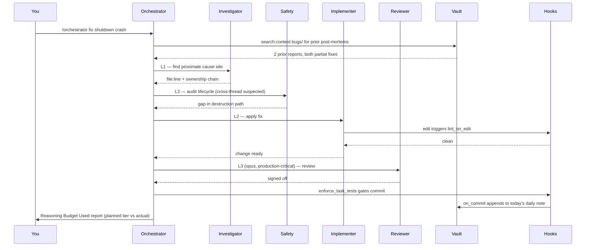
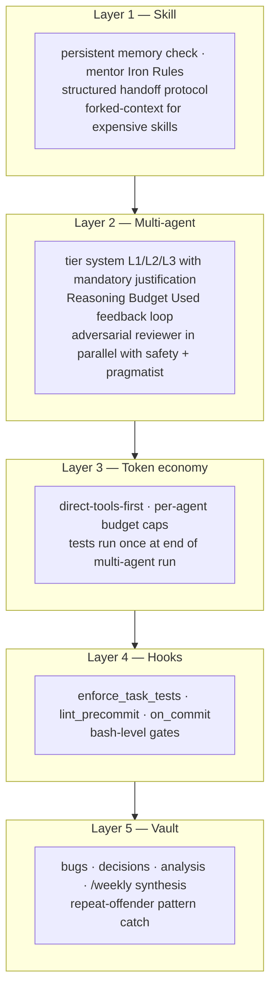

# Team Lead Harness (Agent Orchestration Layer)

A Claude Code workspace for one person running a virtual engineering team.

I built this over four months. Three production codebases: React, Angular, and a C++/Qt UAV ground control app. Five colleagues picked it up after seeing it work. This repo is the sanitized version.

<p align="center">
  
</p>

> **What you're seeing.** The clip above is a fresh deployment of the kit into an empty test project. I open Claude Code, invoke `/investigator`, and ask it to audit the kit's installation state. The investigator runs in a forked context, reads the `.claude/` tree + the vault, classifies what's installed and what's missing, then writes a structured analysis note to `vault/analysis/`. Sped up 2x. Real session, no edits.

<p align="center">
  
</p>

> **Deployment in action.** This clip shows the wizard itself running on the same test project — paste `WIZARD.md` into Claude Code, answer the questions one at a time, end up with `CLAUDE.md`, `.claude/commands/`, `.claude/agents/`, `.claude/hooks/`, and a stack-aware `settings.local.json`. The segment covers Q4.2–Q4.5 (persona delivery format, placeholder fill, subagent metadata), then the Module D hooks, then the Q7 wrap-up. 2x speed.

---

## What is this for

Claude Code is a fast feature shipper out of the box. It also gets out of hand fast. A first-week plan drifts from the code three weeks later. A merge request the model approved misses a race condition a human would have flagged. A multi-agent run burns ten times the tokens of a single call. A decision you made last quarter has to be re-derived because nobody wrote it down.

I built this to solve those problems, not the toy version of them.

**Use this if you are:**

- A solo operator running one or more codebases and want a senior-engineering team's worth of perspectives applied to your work without hiring one.
- A tech lead who needs every change reviewed adversarially before it ships, but cannot afford the round-trip of a human gate every time.
- A founder shipping AI-assisted code who wants the workflow itself to leave an audit trail — what was changed, why, what alternatives were considered, what was rejected and by whom.
- An engineer working across stacks (React + Angular + C++ + Python is what I had) and tired of treating each one as its own context-island. The kit treats stack as a constraint, not an identity.

**Use this if your problem is:**

- "I lose track of decisions I made last month."
- "I have a hot path I am scared to refactor without a second opinion."
- "My agents run away with token budget on tasks that did not need them."
- "I want the same review discipline I would apply at a real company, but I am working alone."
- "My plans drift from the code and I do not notice until production."

**Do not use this if:**

- You are evaluating Claude Code for the first time and have not yet shipped anything with it. Get comfortable with the bare CLI first. Then add this.
- You only want a faster autocomplete. Use Copilot or Cursor. This kit is for orchestration, not completion.
- Your project is a one-week throwaway. The setup cost is real (5–40 min depending on modules), and it pays back over months.
- You are uncomfortable maintaining markdown notes in a separate Obsidian vault. Layer 5 of the self-correction architecture starves without that habit.

This is a tool for engineering at scale with one human in the loop. Not a magic productivity multiplier. Operator judgment is still the most important component.

---

```
operator (you)  →  12 named personas  →  orchestrator
       │                  │                    │
       └──  reads  →  Obsidian vault  (decisions, bugs, plans, daily/weekly)
                              │
            hooks guard every edit, commit, and task completion
```

## 30-second tour

Twelve specialised slash commands. Names: `/implementer`, `/reviewer`, `/investigator`, `/safety`, `/performance`, `/crash`, `/mentor`, `/pragmatist`, `/orchestrator`, `/vault`, `/weekly`, `/domain-skill`.

Investigation runs in a forked context window. The investigator can read 40 files and return a one-page summary without bloating the main conversation.

The orchestrator assigns a reasoning tier (L1, L2, L3) to every spawned agent. It justifies the tier in writing before spawning. After the run it reports planned tier vs actual. That feedback loop is what stops tier inflation week over week.

The Obsidian vault is queried as a graph. The investigator runs `obsidian backlinks file=X` to see what depends on a decision. It runs `obsidian search:context query=Y path=bugs` to find prior post-mortems with matching lines. The kit's long-term memory is queryable, not just searchable.

Ten hooks. They gate task completion on tests, gate commits on lint, append commit logs to the daily note, snapshot state before context compaction, and log subagent findings to the vault.

A written token discipline. Direct tools before agents. Per-agent budget caps. Tests run once at the end of a multi-agent run, not five times.

Full architecture: [`kit/00-MASTER-GUIDE.md`](kit/00-MASTER-GUIDE.md). The self-correction argument: [`kit/08-self-correction.md`](kit/08-self-correction.md).

---

## How a task moves through it

A real task: "fix the intermittent shutdown crash we saw last week."



Each agent has a bounded prompt and a written tier justification. If one misses something, the next agent in the chain has a chance to catch it. That redundancy is the whole point of the architecture.

---

## Numbers

Real work. Sample size is small. Caveats in the right column.

| Metric | Before | After | Caveat |
|---|---|---|---|
| Build time on a legacy decoupling | 90 min | 15–20 min | One project. Planning driven by investigator + planner. Single data point. |
| Document extraction pipeline accuracy | 70% | 90–95% | Twelve months. Multi-step LLM extraction with iterative prompt review. |
| Tool round-trip token cost | MCP baseline | ~40% lower | Migrated high-frequency calls (git, vault, gh) from MCP to CLIs. Per-call measurement. |
| Adoption | 0 | 5 engineers + 1 PM | Two teams. The PM uses the vault and `/mentor` only. |

These are not proof the kit works everywhere. They are evidence it survived three codebases without falling apart.

---

## What the vault looks like

The vault is a separate git repo outside your project. The kit assumes this layout:

```
YourProjectVault/
├── analysis/         ← post-mortems, investigations, profiling reports
├── bugs/             ← bug post-mortems: symptoms, root cause, fix, verification
├── daily/            ← one note per day, auto-populated by hooks
├── decisions/        ← ADRs: why a choice was made, what alternatives were considered
├── guides/           ← best practices per technology
│   └── <tech>/       ← e.g. guides/react/, guides/postgres/
├── memory/           ← long-lived personal notes, team context
├── plans/
│   ├── active/       ← in progress, status: active
│   ├── planning/     ← scoped but not started
│   └── legacy/
│       ├── completed/   ← shipped, kept for historical reference
│       └── superseded/  ← replaced by a better approach
├── quizzes/          ← optional, mentor's flow-tracing questions
├── reference/        ← external docs, cheatsheets
├── templates/        ← skeletons used by hooks and commands
├── weekly/           ← /weekly aggregates 7 dailies into one rollup
├── workflows/        ← development processes and procedures
├── dashboards.md     ← optional, Dataview queries (Obsidian plugin)
├── MEMORY.md         ← top-level index for memory/
└── QUICK_REFERENCE.md ← your own cheatsheet for the vault
```

Skills query the vault as a graph. The vault is the kit's long-term memory.

Full tour with templates for every note type: [`kit/04-vault-blueprint.md`](kit/04-vault-blueprint.md).

---

## The five layers



A bug that slips Layer 1 should hit Layer 2. A token explosion that slips Layer 3 still surfaces in Layer 5's weekly review. No single layer carries the kit.

Full breakdown, worked example, accepted failure modes: [`kit/08-self-correction.md`](kit/08-self-correction.md). The doc is honest about what the kit cannot catch.

---

## Quickstart

Two paths. Pick one.

### Fast: auto-detect script

```bash
git clone https://github.com/gamingfedor-dev/team-lead-harness.git ~/harness
cd /path/to/your/project
~/harness/setup_ai_workspace.sh \
  --project-dir . \
  --vault-dir ../MyProjectVault \
  --ide claude
```

Detects your tech stack. Generates `CLAUDE.md`, `.claude/commands/`, `.claude/agents/`, `.claude/hooks/`, and a stack-aware `settings.local.json`. Initialises your Obsidian vault.

### Flexible: interactive wizard

```bash
cd /path/to/your/project
claude
```

Paste [`WIZARD.md`](WIZARD.md) into the session. One question at a time. Every step is skippable.

---

## Personas at a glance

| Skill | Role | Model | Notes |
|---|---|---|---|
| `/implementer` | Ships features and fixes | sonnet | Forked context. Hands off to `/safety` on memory work. |
| `/investigator` | Gathers references, traces ownership chains | haiku | Forked. The one skill allowed to spawn agents for web/vault retrieval. |
| `/reviewer` | Adversarial review. Edge cases. Untested assumptions. | haiku, opus on production-critical paths | The one path opus runs by default. |
| `/safety` | Memory, lifecycle, resource ownership audits | haiku | Forked. Maps creation, storage, transfer, usage, destruction. |
| `/performance` | Profiles hot paths. Classifies the cause. | haiku | "Measure first" discipline. Three numbers per recommendation. |
| `/crash` | Reads crash reports. Walks backtraces. | haiku | Multi-platform exception tables. Hypothesis with falsification test. |
| `/mentor` | Socratic flow-tracing tutor with a play-state framework | haiku | Seven Iron Rules. Never explains unprompted. Grades 7–10. |
| `/pragmatist` | Anti-over-engineering brake | haiku | Asks "could I hotfix at 3 am?" |
| `/orchestrator` | Multi-agent commander with the tier system | main conv | Phase 1.5 tier assignment. Phase 4 Reasoning Budget Used. |
| `/vault` | Obsidian CLI navigator | haiku | Health checks too: orphans, unresolved wikilinks, deadends. |
| `/weekly` | Aggregates 7 dailies into a weekly rollup | haiku | ISO week numbering. Parses session tables. |
| `/domain-skill` | Template for a project-specific expert | — | Fill once per domain (UAV, payments, design system, etc.). |

Keep the names or rename them. I use anime and film character handles in my own deployment: `/o7`, `/devil`, `/hanji`, `/loid`, `/pylyp`, `/otto`. The pattern is documented in [`kit/02-skill-catalog.md` § Persona Identity](kit/02-skill-catalog.md). Generic names work fine.

---

## Module map

Five independent modules. Pick any combination.

| Module | Time | Depends on | What you get |
|---|---|---|---|
| A. Vault | 10 min | Obsidian app | Knowledge base as a queryable graph |
| B. Claude config | 10 min | — | `CLAUDE.md`, `.claude/`, `settings.local.json` |
| C. Personas | 20 min | B | The 12 slash commands |
| D. Hooks | 10 min | B (A recommended) | Session, edit, commit, agent-stop gates |
| E. Validation | 5 min | whichever you ran | Smoke test |

Minimum viable: B alone. Recommended starter: B + C. Full setup: A, B, C, D, E.

---

## FAQ

**Is this just a Claude Code config?**
No. A config is `settings.local.json`. This is a workflow with five layers of correction built in. The config is one of the layers.

**Why Obsidian, not Notion or Linear or a GitHub wiki?**
The vault is a local markdown directory the CLI reads in milliseconds. Obsidian has graph traversal commands (`backlinks`, `links`) the investigator depends on. Notion's API is slow. Linear is per-issue. Wikis have no graph queries. Swap if you want. The abstraction is "a markdown directory with a CLI."

**Twelve personas feels like a lot.**
You will not use them all. Minimum viable: three. `/implementer`, `/reviewer`, `/investigator`. Add more when you hit a problem the current set does not cover. I run with five most days.

**Will this work without the vault?**
Yes. Self-correction degrades. The vault is layer 5. Skipping it means repeat-offender bugs are not surfaced, decisions are not recorded, and the investigator cannot graph-traverse prior work. Vault-writing hooks become no-ops, no errors.

**Will this work on Windows?**
The hook scripts are bash. WSL works. Native Windows needs a PowerShell port. PRs welcome.

**How much does it cost to run?**
Depends on how many multi-agent orchestrations you spawn. Single-skill use is cheap. The token rules in Layer 3 exist to bound multi-agent runs. Without them they get expensive fast.

**What does it not catch?**
Bad requirements. A correctly-implemented wrong feature is still wrong. Also vault rot (if you stop writing post-mortems, layer 5 starves), hook drift (lint config diverges from project), and bug classes the reviewer was not given expertise to look for. [`kit/08-self-correction.md` § Failure Modes](kit/08-self-correction.md) is explicit about this.

**Can I use this with Cursor or other tools instead of Claude Code?**
Partially. The vault, templates, and persona prompts port. The hooks and `.claude/` directory are Claude Code-specific. Cursor users have lifted personas from `templates/personas/` and the patterns from `kit/02-skill-catalog.md`.

---

## What is in this repo

```
team-lead-harness/
├── README.md              ← you are here
├── WIZARD.md              ← paste into Claude Code for interactive setup
├── setup_ai_workspace.sh  ← auto-detect script (alternative to wizard)
├── kit/                   ← reference docs, read once for context
│   ├── 00-MASTER-GUIDE.md
│   ├── 01-claude-md-template.md
│   ├── 02-skill-catalog.md       ← persona templates + identity pattern
│   ├── 03-hooks-kit.md           ← every hook script
│   ├── 04-vault-blueprint.md     ← vault structure + Obsidian CLI
│   ├── 05-token-strategy.md
│   ├── 06-settings-reference.md
│   ├── 07-onboarding-quickstart.md
│   └── 08-self-correction.md     ← the architecture argument
└── templates/             ← files copied into your project
    ├── personas/          ← 12 persona templates
    ├── scripts/           ← 12 hook + helper scripts
    ├── vault/             ← 9 vault note templates
    └── guides/            ← seed guides
```

## Status

Daily use since early 2026. React 19, Angular 20, C++/Qt6, Python. Setup script verified end-to-end on a fresh project. Issues and PRs welcome.

## License

MIT.
