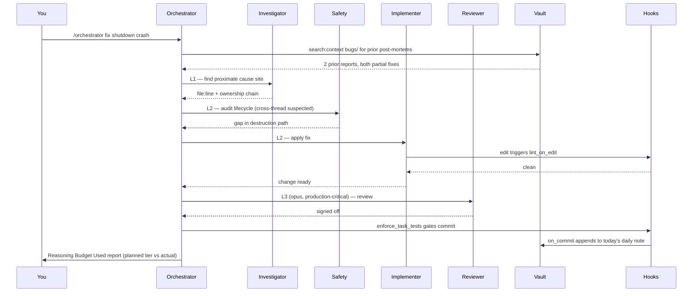
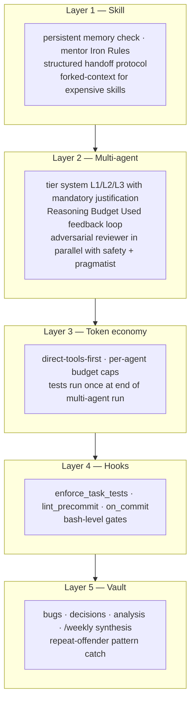

# team-lead-harness

A Claude Code workspace for one person running a virtual engineering team.

I built this over four months across three production codebases — React, Angular, and a C++/Qt UAV ground control app. Five colleagues picked it up after seeing it work. This repo is the sanitized version.

```
operator (you) ──▶  12 named personas  ──▶  orchestrator
       │                  │                       │
       └── reads ──▶ Obsidian vault (decisions, bugs, plans, daily/weekly)
                                │
                hooks guard every edit, commit, and task completion
```

## 30-second tour

- Twelve specialised slash commands. `/implementer`, `/reviewer`, `/investigator`, `/safety`, `/performance`, `/crash`, `/mentor`, `/pragmatist`, `/orchestrator`, `/vault`, `/weekly`, and a `/domain-skill` template.
- Investigation runs in a forked context window so big lookups don't pollute your main conversation.
- The orchestrator assigns a reasoning tier (L1/L2/L3) to every spawned agent and has to justify it in writing. After the run it reports what tier it actually used vs what it planned. That feedback loop is what stops tier inflation week over week.
- Obsidian vault, queried as a graph. The investigator runs `obsidian backlinks file=X` to see what depends on a decision; `obsidian search:context query=Y path=bugs` to find prior post-mortems with matching lines. No more re-grepping the world.
- Ten hooks that gate task completion on tests, gate commits on lint, append commit logs to the daily note, snapshot state before context compaction, and log subagent findings to the vault.
- A written token discipline. Direct tools before agents. Per-agent budget caps. Tests run once at the end of a multi-agent run, not five times.

Full architecture: [`kit/00-MASTER-GUIDE.md`](kit/00-MASTER-GUIDE.md). The self-correction argument: [`kit/08-self-correction.md`](kit/08-self-correction.md).

---

## How a task moves through it

A real task — "fix the intermittent shutdown crash we saw last week":



Each agent is bounded by the prompt, justified by tier, and logged on exit. If one of them misses something, the next has a chance to catch it.

---

## Numbers

From real work, not benchmarks. Sample size is small. Caveats in the right column.

| Metric | Before | After | Where + caveats |
|---|---|---|---|
| Build time on a legacy decoupling | 90 min | 15–20 min | One project; planning driven by investigator + planner. Single data point. |
| Document extraction pipeline accuracy | 70% | 90–95% | Twelve months, iterative prompt review. Multi-step LLM extraction. |
| Tool round-trip token cost | MCP baseline | ~40% lower | After moving high-frequency calls (git, vault, gh) from MCP to CLIs. Measured per-call. |
| Adoption | 0 | 5 engineers + 1 PM | Two teams. PM uses the vault and mentor only. |

These aren't proof the kit works everywhere. They're evidence it survived three different codebases without falling apart.

---

## What the vault looks like

The vault is a separate git repo outside your project. The kit assumes this layout:

```
YourProjectVault/
├── analysis/         ← post-mortems, investigations, profiling reports
├── bugs/             ← bug post-mortems: symptoms → root cause → fix → verification
├── daily/            ← one note per day, auto-populated by hooks
├── decisions/        ← ADRs: why a choice was made, what alternatives were considered
├── guides/           ← best practices per technology
│   └── <tech>/       ← e.g. guides/react/, guides/postgres/
├── memory/           ← long-lived personal notes, team context
├── plans/
│   ├── active/       ← in progress, status: active
│   ├── planning/     ← scoped but not started
│   └── legacy/
│       ├── completed/   ← shipped, kept for historical reference
│       └── superseded/  ← replaced by a better approach
├── quizzes/          ← optional, mentor's flow-tracing questions
├── reference/        ← external docs, cheatsheets
├── templates/        ← skeletons used by hooks and commands
├── weekly/           ← /weekly aggregates 7 dailies into one rollup
├── workflows/        ← development processes and procedures
├── dashboards.md     ← optional, Dataview queries (Obsidian plugin)
├── MEMORY.md         ← top-level index for memory/
└── QUICK_REFERENCE.md ← your own cheatsheet for the vault
```

Skills query the vault as a graph. The vault is the kit's long-term memory.

Full tour with templates for every note type: [`kit/04-vault-blueprint.md`](kit/04-vault-blueprint.md).

---

## The five layers



A bug that slips Layer 1 should hit Layer 2. A token explosion that slips Layer 3 still surfaces in Layer 5's weekly review. The whole point is that no single layer carries the kit.

Full breakdown, worked example, and the failure modes the kit cannot catch: [`kit/08-self-correction.md`](kit/08-self-correction.md). It's honest about what it doesn't do.

---

## Quickstart

Two paths. Pick one.

### Fast — auto-detect script

```bash
git clone https://github.com/gamingfedor-dev/team-lead-harness.git ~/harness
cd /path/to/your/project
~/harness/setup_ai_workspace.sh \
  --project-dir . \
  --vault-dir ../MyProjectVault \
  --ide claude
```

Detects your tech stack. Generates `CLAUDE.md`, `.claude/commands/`, `.claude/agents/`, `.claude/hooks/`, and a stack-aware `settings.local.json`. Initialises your Obsidian vault.

### Flexible — interactive wizard

```bash
cd /path/to/your/project
claude
```

Paste [`WIZARD.md`](WIZARD.md) into the session. The wizard asks one question at a time. Every step is skippable.

---

## Personas at a glance

| Skill | Role | Model | Notes |
|---|---|---|---|
| `/implementer` | Ships features and fixes | sonnet | Forked context. Hands off to `/safety` on memory work. |
| `/investigator` | Gathers references, traces ownership chains | haiku | Forked. Only skill allowed to spawn agents for retrieval (web/vault). |
| `/reviewer` | Adversarial review, edge cases, untested assumptions | haiku, opus on production-critical paths | The one path opus runs by default. |
| `/safety` | Memory, lifecycle, resource ownership audits | haiku | Forked. Maps creation → storage → transfer → usage → destruction. |
| `/performance` | Profiles hot paths, classifies cause | haiku | Forced "measure first" discipline. Three-numbers rule for every recommendation. |
| `/crash` | Reads crash reports, walks backtraces | haiku | Multi-platform exception tables. Hypothesis with falsification test. |
| `/mentor` | Socratic flow-tracing tutor with a play-state framework | haiku | Seven Iron Rules. Never explains unprompted. Grades 7–10. |
| `/pragmatist` | Anti-over-engineering brake | haiku | Asks "could I hotfix at 3 am?" |
| `/orchestrator` | Multi-agent commander with tier system | main conv | Phase 1.5 tier assignment, Phase 4 Reasoning Budget Used. |
| `/vault` | Obsidian CLI navigator | haiku | Health checks too: orphans, unresolved wikilinks, deadends. |
| `/weekly` | Aggregates 7 dailies into a weekly rollup | haiku | ISO week numbering. Parses session tables. |
| `/domain-skill` | Template for a project-specific expert | — | Fill once per domain (UAV, payments, design system, etc.). |

You can keep these names or rename them. I use anime and film character handles — `/o7`, `/devil`, `/hanji`, `/loid`, `/pylyp`, `/otto` — for reflexive routing in my head. The pattern is documented in [`kit/02-skill-catalog.md` § Persona Identity](kit/02-skill-catalog.md). Generic names work fine.

---

## Module map

The kit ships as five independent modules. Pick any combination.

| Module | Time | Depends on | What you get |
|---|---|---|---|
| A. Vault | 10 min | Obsidian app | Knowledge base as a queryable graph |
| B. Claude config | 10 min | — | `CLAUDE.md` + `.claude/` + `settings.local.json` |
| C. Personas | 20 min | B | The 12 slash commands |
| D. Hooks | 10 min | B (A recommended) | Session, edit, commit, agent-stop gates |
| E. Validation | 5 min | whichever you ran | Smoke test |

Minimum viable: B alone. Recommended starter: B + C. Full setup: A → B → C → D → E.

---

## FAQ

**Is this just a Claude Code config?**
No. A config is `settings.local.json`. This is a workflow with five layers of correction built in. The config is one of the layers, not the whole thing.

**Why Obsidian, not Notion / Linear / a GitHub wiki?**
The vault needs to be a local markdown directory the CLI can read in milliseconds. Obsidian also has graph traversal commands (`backlinks`, `links`) the investigator depends on. Notion's API is slow. Linear is per-issue. Wikis have no graph queries. You can swap if you want; the abstraction is "a markdown directory with a CLI."

**Twelve personas feels like a lot.**
You won't use them all. The minimum viable set is three: `/implementer`, `/reviewer`, `/investigator`. Add more when you hit a problem the current set doesn't cover. Most days I run with five.

**Will this work without the vault?**
Yes, with degraded self-correction. The vault is layer 5. Skipping it means repeat-offender bugs aren't surfaced, decisions aren't recorded, and the investigator can't graph-traverse prior work. Vault-writing hooks become no-ops, no errors.

**Will this work on Windows?**
The hook scripts are bash. WSL is fine. Native Windows would need a PowerShell port. PRs welcome.

**How much does it cost to run?**
Depends on how many multi-agent orchestrations you spawn. Single-skill use is cheap. The token economy rules in Layer 3 exist to keep multi-agent runs bounded; without them they get expensive quickly.

**What does it not catch?**
Bad requirements. A correctly-implemented wrong feature is still wrong. Also: vault rot (if you stop writing post-mortems, layer 5 starves), hook drift (lint config diverges from project), and bug classes the reviewer wasn't given expertise to look for. [`kit/08-self-correction.md` § Failure Modes](kit/08-self-correction.md) is explicit about this.

**Can I use this with Cursor / Codex / other tools instead of Claude Code?**
Partially. The vault, templates, and persona prompts port. The hooks and the `.claude/` directory are Claude Code-specific. Cursor users have lifted personas from `templates/personas/` and the patterns from `kit/02-skill-catalog.md`.

---

## What's in this repo

```
team-lead-harness/
├── README.md              ← you are here
├── WIZARD.md              ← paste into Claude Code for interactive setup
├── setup_ai_workspace.sh  ← auto-detect script (alternative to wizard)
├── kit/                   ← reference docs, read once for context
│   ├── 00-MASTER-GUIDE.md
│   ├── 01-claude-md-template.md
│   ├── 02-skill-catalog.md       ← persona templates + identity pattern
│   ├── 03-hooks-kit.md           ← every hook script
│   ├── 04-vault-blueprint.md     ← vault structure + Obsidian CLI
│   ├── 05-token-strategy.md
│   ├── 06-settings-reference.md
│   ├── 07-onboarding-quickstart.md
│   └── 08-self-correction.md     ← the architecture argument
└── templates/             ← files copied into your project
    ├── personas/          ← 12 persona templates
    ├── scripts/           ← 12 hook + helper scripts
    ├── vault/             ← 9 vault note templates
    └── guides/            ← seed guides
```

## Status

Daily use since early 2026. React 19, Angular 20, C++/Qt6, Python. Setup script verified end-to-end on a fresh project. Issues and PRs welcome.

## License

MIT.
